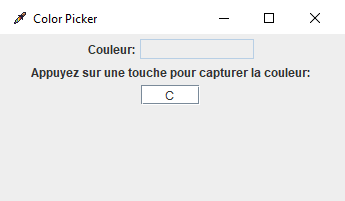
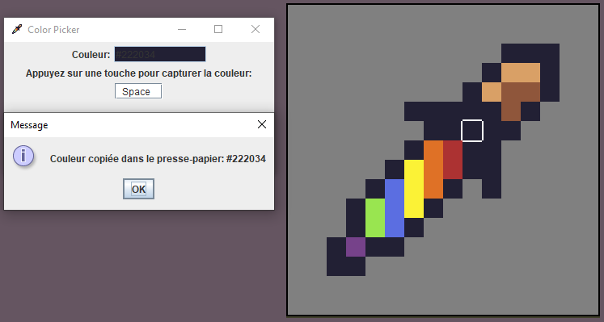

# Pip'In, le programme simple pour une mission simple

## Pré-requis

- Java >= 17 : (download)[https://www.oracle.com/java/technologies/javase/jdk17-archive-downloads.html]

## Introduction

### Description

Pip'In est un petit programme écrit en Java vanilla, permettant de récupérer la couleur d'un pixel sur l'écran. On peut configurer la touche de raccourci pour activer la saisie de la couleur. Lorsque la touche est pressée, le programme calcule la valeur hexadécimale de la couleur du pixel sous le curseur de la souris et la copie dans le presse-papiers, une pop-up s'affiche pour annoncer la couleur récupérée et la couleur est affichée dans un rectangle sur la fenêtre du programme.

### ScreenShot

## Installation

- Cloner le projet
- Ouvrir le .jar

## Utilisation

- Configurer la touche de raccourci (par défaut la touch `C` est utilisée) pour activer la récupération de la couleur
- Tout en gardant le focus sur la fenêtre du programme, placer le curseur de la souris sur la couleur à récupérer
- Appuyer sur la touche de raccourci pour récupérer la couleur
- La couleur récupérée est copiée dans le presse-papiers, il ne reste plus qu'à la coller où vous le souhaitez

## Licence

MIT LICENCE - [Lire la licence](./LICENSE)

## Auteur

- Yoann JOB
